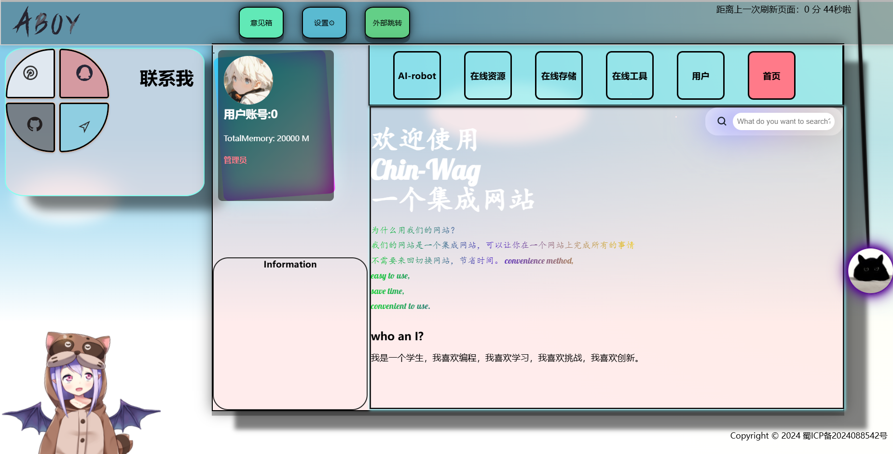
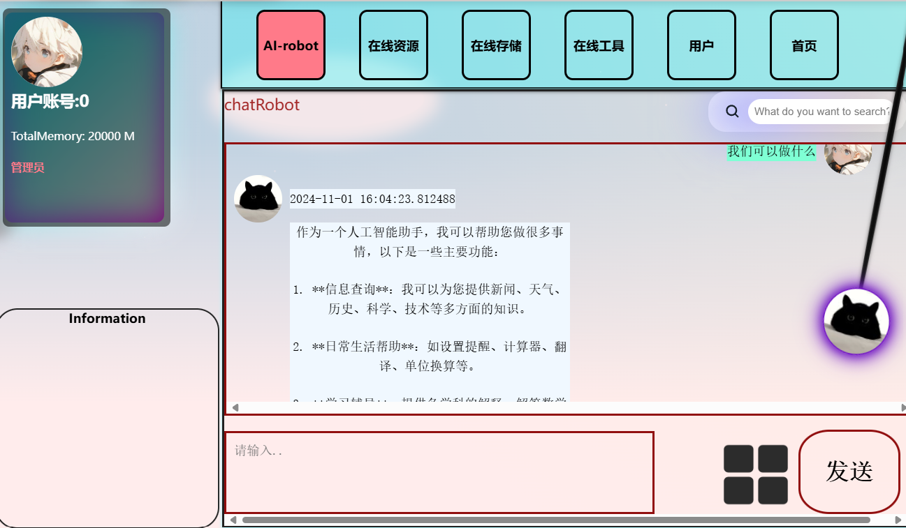

# Chin-Wag

## What is Chin-Wag?
LOOK HERE

Solve your problem



## Project setup

```bash
yarn
```

### Compiles and hot-reloads for development

```bash
yarn serve
```

### Compiles and minifies for production

```bash
yarn build
```

### Lints and fixes files

```bash
yarn lint
```

### Customize configuration
See [Configuration Reference](https://cli.vuejs.org/config/).

>author
>qq:2041584846
>github:llj123456789
